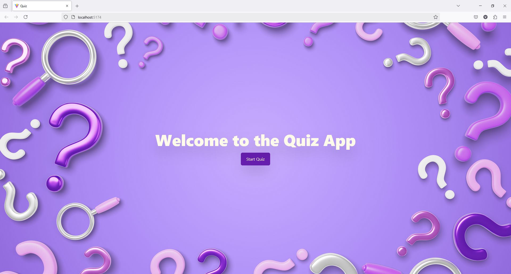
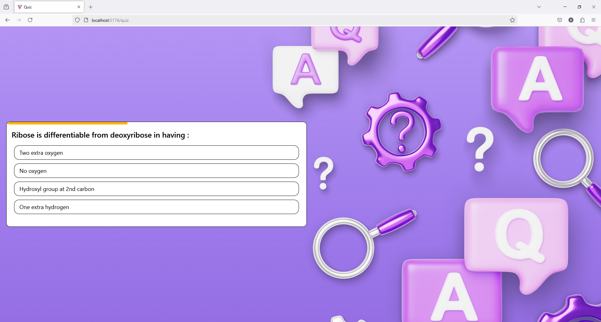
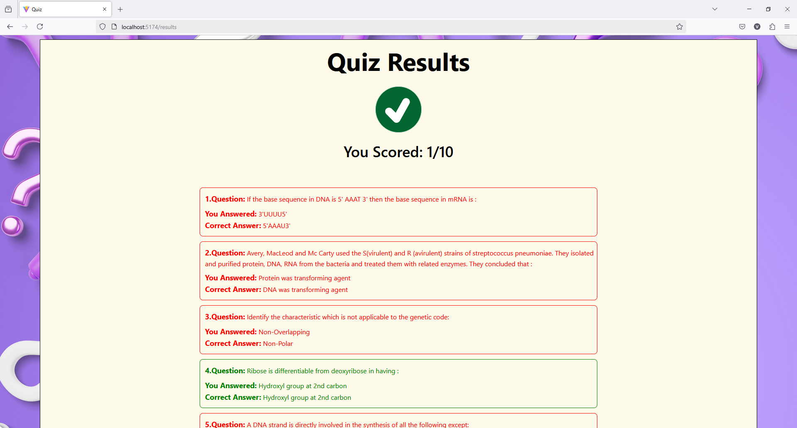

# Quiz App with Gamification

## Overview
This is a web-based quiz application built with React. It fetches quiz data from an API and presents it in a gamified manner.

## Features
- Start Quiz
- Multiple-choice questions
- Results summary
- Gamification elements (progress bar, and points system)

## Setup
1. Clone the repository.
2. Run `npm install` to install dependencies, ensure to run this command inside quiz-app and also inside backend folder.
3. Run `npm run dev` to start the development server.
4. Run `node server.js` inside backend folder to start backend server.

## Screenshots

## Video Walkthrough
[Watch the app in action](final-demo/demo.mp4)